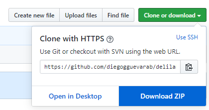

# Delilah Restó
Este repositorio alberga el código fuente de una API desarrollada en JavaScript usando Express.js, MySQL, JWT y 
Sequelize.

## Instalación
### Primeros pasos
Para iniciar debe clonar o descargar este repositorio en su equipo. Para la clonación debe ejecutar el siguiente comando:
    
    git clone https://github.com/diegogguevarab/delilah-resto.git

Para descargarlo puede usar la opción 'Clone or download' para obtener un archivo comprimido en formato ZIP.

Luego de esto debe descomprimir el archivo en una ubicación de su elección y acceder a este directorio desde una ventana
de terminal para continuar.
### Base de datos
Para la creación de la base de datos se debe usar el script `db_bootstrap.sql` ubicado en la raíz de este proyecto. 
Este script se puede ejecutar desde la línea de comandos o terminal haciendo uso de la instrucción `mysql` de la 
siguiente forma:

    mysql < db_bootstrap.sql -uroot -p
En caso de no disponer del comando `mysql` en su terminal puede abrir el script en MySQL Workbench y ejecutarlo desde 
allí.
##### Importante:
Dentro de este archivo se crean objetos de prueba para todas las tablas. Los más relevantes son los usuarios ya creados, 
los cuales son:

- **Administrador** 
    - **Nombre de usuario:**  delilah-admin
    - **Email:** admin@delilah.com
    - **Contraseña:** Admin-123!
- **Usuario de pruebas**
    - **Nombre de usuario:**  delilah-tester
    - **Email:** tester@delilah.com
    - **Contraseña:** T3st_P422
### Servidor de Express.js
Para este proyecto se hace uso del gestor de librerías `npm` por lo tanto es importante que este se encuentre instalado
en su equipo.
Para instalar las dependencias del proyecto ejecute el siguiente comando:

    npm i
 
Después de esto ya puede ingresar el comando:
    
    npm start
    
Para ejecutar la API de Delilah Restó.

### Funcionamiento de la API 

Para una descripción amplia de la API y sus endpoints puede acceder al path [localhost:3500/docs/](http://localhost:3500/docs/#/paths/) luego de ejecutar el proyecto.

Para probar la API puede usar el siguiente [*Collection*](https://www.getpostman.com/collections/96be5c2968f0f870e4d5) 
de [Postman](https://www.postman.com/).